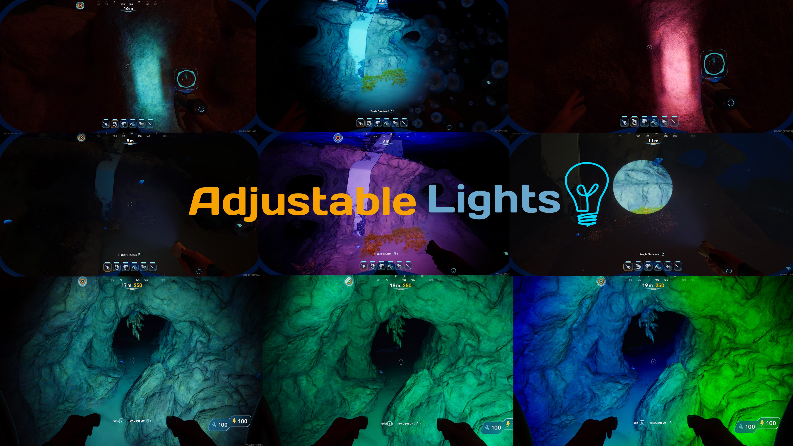

# Adjustable Lights

**Allows You To Customize Tool/Vehicle Lights With Your Choice Of Color, Intensity, Temperature, Cone Angles Etc!**

***

## **Features:-**

- **Customize To Your Liking:** Modify Color, Intensity, Attenuation Radius, Inner/Outer Cone Angles, Temperature, And Light Falloff!

- **Full RGB Support:** Specify Any Values Of RGB From 0 To 255!

- **Per-Component Control:** Independently Adjust The "Main" and "Helper" Lights On Vehicles Like The Tadpole Or Tools Like The WakeMaker To Get The Perfect Lighting Balance!

- **Hot Reload:** No Need To Restart The Game Or Anything, It Will Automatically Reload Your Settings As Soon As You Apply Them!

## **Configuration Options:-**

- **Intensity:** How Bright The Light Is. Higher Values Make It Blinding While Lower Values Are Dimmer And Easier On The Eyes.
- **Inner/Outer Angles:** The "Spread" Of The Light

    - **Inner:** The Bright Center Of Your Light.
    - **Outer:** The Wide, Soft Edge Of The Beam.

- **Attenuation Radius:** How Far The Light Beam Travels Into The Darkness Before Fading Away.

- **Temperature:** Changes The "Mood" Of The Light. Lower Values (E.G., 3000) Make The Light Look Warm And Orange While Higher Values (E.G., 10000) Look Cool, And Icy (Acutally Very Hot But Oh Well) Blue; Find More Info Here; The Value Is In Kelvins

- **FallOff Exponent:** Controls How Quickly The Light Fades Out At Its Edges. A Higher Number Creates A Sharper, More Defined Beam While A Lower Number Makes The Light Blend More Softly Into The Surroundings.

- **Color (RGB):** Gives You Full Control Over The Light's Color, You Can Use Any [RGB Color Calculator](https://www.rapidtables.com/web/color/RGB_Color.html) To Get The Values!

<u>**Note:- You Can Use In-Game Settings Through The [Mod Settings For Subnautica 2](https://www.nexusmods.com/subnautica2/mods/20) Mod To Adjust The Values!**</u>

***

## **Currently Supported Lights:-**

- **Flashlight**
- **Wakemaker**
- **Scanner**
- **WorkLight**
- **Tadpole (Default)**
- **Tadpole (Scout Ray)**
- **Tadpole (Hauler)**

***

## **Installation:-**

### **Manual:-**

1. Download Required Dependencies Using Their Installation Methods
2. Download This Mod Through The Files Tab 
3. Extract The Archive To Your `Subnautica2\Subnautica2\Binaries\Win64\ue4ss\Mods` Folder
4. Enjoy!

***

## **TODO:-**

- ~~Support Tadpole Chassis'~~
- ~~Support WorkLight~~
- Maybe Add VolumetricScatteringIntensity And SpecularScale Customization (If Y'all Want This Then I'll Implement It)

## **Notes:-**

- This Is My Fourth Mod Ever (I Really Need To Stop Saying That Every Mod LOL). This Was One Of My First Expiriences With Lua Which Felt Kind Of Weird B/C I Am Very Used To Types Lol (As You Can See By All The Annotations In The Code).
- Please Report Any Bugs In The Posts/Bugs Tab
- The Code Is Fully Open Source On My [Github](https://github.com/LabrynthKing/AdjustableLights)
- My Discord Username Is `labrynthking`

## **Credits:-**

- **[JustChaldea](https://www.nexusmods.com/profile/JustChaldea):** For The [Mod Settings For Subnautica 2](https://www.nexusmods.com/subnautica2/mods/20) Mod
- **[The Nautilus & The UE4SS Dev Team](https://www.nexusmods.com/subnautica2/mods/36):** For Providing & Maintaining
  Such A Great Tool For The Unreal Engine